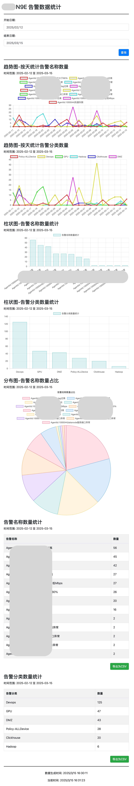

# HedwigEye

[English](../README.md) | [简体中文](./README_zh-cn.md)

## 项目概述
HedwigEye 是一个用于 N9E 监控和统计告警数据查看的 Web 应用程序。它通过图表和表格的形式展示了告警名称和分类的数量统计，并提供了导出功能，方便用户将数据保存为 CSV 文件。

## 主要功能
- **告警数据查询**: 用户可以选择开始日期和结束日期，查询指定时间段内的告警数据。
- **数据可视化**: 通过折线图、柱状图和饼图展示告警名称和分类的数量统计。
- **数据导出**: 支持将告警名称和分类的统计数据导出为CSV文件。
- **实时时间显示**: 显示数据生成时间和当前时间。

## 技术栈
- **前端**: HTML, CSS, JavaScript, Bootstrap, Chart.js
- **后端**: Go (Golang)
- **数据库**: MySQL

## 项目页面预览

